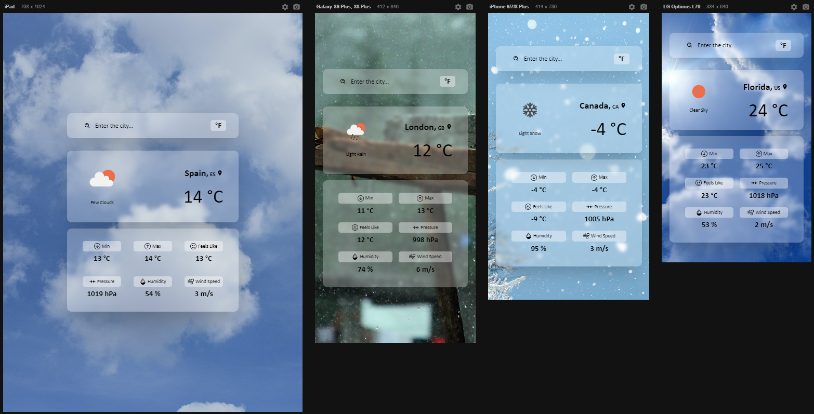

# <h1 align="center">React - Weather App ⛅️</h1>

<p align="center">A simple Weather App built using ReactJS.</p>

<div align="center">
    
</div>

## 💎 Features

<ul>
  <li>🔍 Search by city or country name to get the current weather forecast</li>
  <li>🌅 Dynamically changing background image according to the weather</li>
  <li>🌕 Values can be displayed in Celsius (°C) or Fahrenheit (°F)</li>
  <li>💻 Full responsive design</li>
</ul>

## 📭 API
[`OpenWeather`](https://openweathermap.org/)

## 💻 Live Demo

Check the live demo here 👉 [Demo](https://weather-app-kaderbrl.vercel.app/) 

## 📋 Instructions

First clone this repository.

```shell
git clone https://github.com/kaderbrl/weather-app-react.git
```

Install dependencies. Make sure you already have [`node.js`](https://nodejs.org/en/) & [`npm`](https://www.npmjs.com/) installed in your system.

```shell
$ npm install # or yarn
```

Run it.

```shell
$ npm start # or yarn start
```

## 📱Responsive Design
<div align="center">
    
</div>

## Languages and Tools

<div align="left">
  
  
  
  
  
</div>
